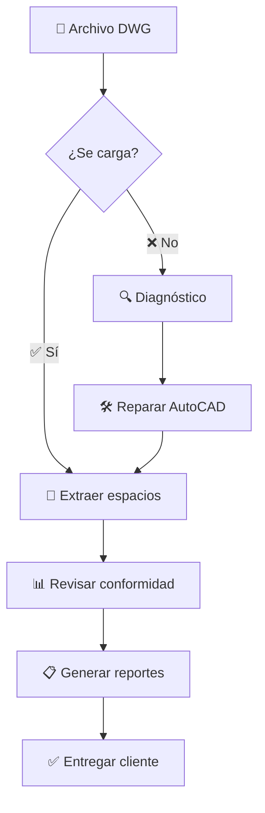

# RevisorArquitectonico

**Sistema profesional de revisión y validación de proyectos arquitectónicos conforme a reglamentos de construcción mexicanos**

[](https://github.com/usuario/RevisorArquitectonico)
[](https://github.com/usuario/RevisorArquitectonico)
[](LICENSE)

## 📋 Descripción

**RevisorArquitectonico** es una herramienta especializada que analiza automáticamente archivos de AutoCAD (DWG) para verificar el cumplimiento de proyectos arquitectónicos con los reglamentos de construcción vigentes en México. 

La aplicación genera reportes profesionales detallados que facilitan el proceso de revisión técnica y aseguran que los proyectos cumplan con las normativas municipales antes de ser presentados a las autoridades correspondientes.

## ✨ Características Principales

### 🏗️ **Análisis Integral de Conformidad**
- **Zonificación y uso de suelo** - Verificación de compatibilidad con planes de desarrollo urbano
- **Coeficientes urbanísticos** - Validación de COS (Coeficiente de Ocupación del Suelo) y CUS
- **Dimensiones mínimas** - Revisión de espacios habitables según normativas
- **Condiciones de habitabilidad** - Verificación de ventilación e iluminación natural
- **Retiros y alineamientos** - Validación de restricciones frontales, laterales y posteriores

### 📐 **Procesamiento Automático de Planos**
- **Lectura de archivos DWG** - Compatible con versiones AutoCAD 2007-2022
- **Extracción automática de espacios** - Identificación inteligente de recámaras, baños, cocinas, etc.
- **Cálculo de áreas y perímetros** - Mediciones precisas automáticas
- **Detección de elementos constructivos** - Identificación de muros, puertas y ventanas

### 📊 **Reportes Profesionales**
- **Reporte HTML visual** - Formato profesional para presentación a clientes
- **Reporte JSON estructurado** - Para integración con otros sistemas
- **Resumen ejecutivo** - Con estadísticas de conformidad
- **Recomendaciones técnicas** - Sugerencias para cumplimiento normativo

### 🔧 **Herramientas de Diagnóstico**
- **Diagnóstico automático** - Detección y solución de problemas en archivos DWG
- **Múltiples métodos de recuperación** - Para archivos dañados o incompatibles
- **Generación de scripts de AutoCAD** - Para reparación automática de archivos
- **Archivos de ejemplo** - Para pruebas y demostración

## 🎯 **Normativas Incluidas**

El sistema incluye las siguientes normativas mexicanas:

| Normativa | Descripción | Valores Típicos |
|-----------|-------------|-----------------|
| **Dimensiones mínimas** | Espacios habitables | Recámara: ≥7 m², Cocina: ≥6 m² |
| **Coeficientes urbanísticos** | COS/CUS por zonificación | Habitacional: 60%, Agroindustrial: 50% |
| **Retiros obligatorios** | Distancias a linderos | Frontal: 3m, Lateral: 1.5m, Posterior: 3m |
| **Alturas máximas** | Límites de construcción | 3 niveles / 10.5 metros |
| **Ventilación e iluminación** | Porcentaje de área del local | Ventilación: 10%, Iluminación: 15% |

*Las normativas pueden personalizarse según reglamentos municipales específicos*

## 💻 Requisitos del Sistema

- **Sistema Operativo:** Windows 10/11 (64-bit)
- **RAM:** 4 GB mínimo, 8 GB recomendado
- **Espacio en disco:** 100 MB para instalación
- **AutoCAD:** Opcional (solo para reparación de archivos DWG problemáticos)

## 📥 Instalación y Descarga

### Descarga Directa
1. Ir a [Releases](https://github.com/usuario/RevisorArquitectonico/releases)
2. Descargar la última versión: `RevisorArquitectonico-v1.0.0.zip`
3. Extraer el archivo ZIP en la carpeta deseada
4. Ejecutar `RevisorArquitectonico.exe`

### Instalación Portátil
- **No requiere instalación** - Aplicación portátil
- **No modifica el registro** - Ejecución independiente
- **No requiere permisos de administrador**

## 🚀 Guía de Uso

### Uso Básico

```bash
RevisorArquitectonico.exe proyecto.dwg --area-terreno 500.0
```

### Uso Completo

```bash
RevisorArquitectonico.exe "C:\Proyectos\Casa Familiar.dwg" ^
    --area-terreno 450.0 ^
    --uso-suelo habitacional ^
    --salida reporte_casa_familiar ^
    --diagnostico
```

### Parámetros Disponibles

| Parámetro | Descripción | Requerido | Ejemplo |
|-----------|-------------|-----------|---------|
| `archivo.dwg` | Archivo DWG a revisar | ✅ | `"proyecto.dwg"` |
| `--area-terreno` | Área del terreno (m²) | ✅ | `--area-terreno 300.0` |
| `--uso-suelo` | Tipo de zonificación | ❌ | `--uso-suelo habitacional` |
| `--salida` | Nombre de reportes | ❌ | `--salida mi_reporte` |
| `--diagnostico` | Diagnóstico del DWG | ❌ | `--diagnostico` |

### Tipos de Uso de Suelo

- `habitacional` - Viviendas unifamiliares y multifamiliares
- `agroindustrial` - Bodegas, naves industriales, procesamiento
- `mixto` - Uso habitacional con comercial

## 📖 Ejemplos de Uso

### Ejemplo 1: Casa Habitacional

```bash
RevisorArquitectonico.exe "Casa_Lopez.dwg" --area-terreno 280.0 --uso-suelo habitacional
```

**Genera:**
- `reporte_conformidad.html` - Reporte visual
- `reporte_conformidad.json` - Datos estructurados

### Ejemplo 2: Proyecto Agroindustrial

```bash
RevisorArquitectonico.exe "Bodega_Agricola.dwg" ^
    --area-terreno 2500.0 ^
    --uso-suelo agroindustrial ^
    --salida revision_bodega_2024
```

### Ejemplo 3: Diagnóstico de Archivo Problemático

```bash
RevisorArquitectonico.exe "archivo_problema.dwg" ^
    --area-terreno 400.0 ^
    --diagnostico
```

## 🔧 Herramientas Adicionales

### Utilidades de Diagnóstico

```bash
# Diagnóstico detallado
UtilsDWG.exe diagnostico --archivo "proyecto.dwg"

# Crear archivo de ejemplo
UtilsDWG.exe ejemplo --salida "casa_ejemplo.dwg"

# Generar script de reparación AutoCAD
UtilsDWG.exe script-repair --archivo "proyecto.dwg"
```

## 📊 Interpretación de Reportes

### Reporte HTML
- **Resumen ejecutivo** con estadísticas generales
- **Tabla de conformidad** con códigos de colores:
  - 🟢 **Verde** - Aspecto conforme
  - 🔴 **Rojo** - Requiere corrección
- **Recomendaciones técnicas** para cumplimiento

### Estados de Revisión

| Estado | Significado | Acción Requerida |
|--------|-------------|------------------|
| ✅ **Conforme** | Cumple normativa | Ninguna |
| ❌ **No Conforme** | Requiere modificación | Ajustar proyecto |
| ⚠️ **Verificar** | Revisar en sitio | Validación adicional |

## 🛠️ Solución de Problemas

### Error: "Invalid group code"

**Problema:** Archivo DWG corrupto o versión incompatible

**Solución:**
1. Ejecutar con `--diagnostico`
2. Usar `UtilsDWG.exe script-repair`
3. Abrir en AutoCAD y usar comando `AUDIT`
4. Guardar como DWG versión 2018

### Error: "No se encontraron espacios"

**Problema:** Plano sin polilíneas cerradas para espacios

**Solución:**
- El programa continuará con espacios de ejemplo
- Verificar que espacios estén dibujados como polilíneas cerradas
- Añadir etiquetas de texto cerca de cada espacio

### Error: "Archivo no encontrado"

**Problema:** Ruta incorrecta al archivo

**Solución:**
- Usar comillas para rutas con espacios: `"C:\Mi Carpeta\archivo.dwg"`
- Verificar que el archivo exista y tenga permisos de lectura

## 📋 Flujo de Trabajo Recomendado



## 🏢 Casos de Uso Profesionales

### Despachos de Arquitectura
- **Revisión previa** a entrega de proyectos
- **Control de calidad** interno
- **Cumplimiento normativo** automatizado

### Autoridades Municipales
- **Agilización de trámites** de construcción
- **Revisión técnica** estandarizada
- **Generación de dictámenes** técnicos

### Desarrolladores Inmobiliarios
- **Validación de proyectos** antes de construcción
- **Optimización de diseños** para maximizar aprovechamiento
- **Reducción de observaciones** en trámites

## 🔄 Actualizaciones

### Versión 1.0.0 (Actual)
- ✅ Análisis completo de conformidad reglamentaria
- ✅ Soporte para DWG AutoCAD 2007-2022
- ✅ Reportes HTML y JSON profesionales
- ✅ Herramientas de diagnóstico y reparación
- ✅ Normativas mexicanas preconfiguradas

### Próximas Versiones
- 🔄 Interfaz gráfica de usuario (GUI)
- 🔄 Soporte para archivos DXF
- 🔄 Integración con bases de datos catastrales
- 🔄 Generación de planos de observaciones
- 🔄 API para integración con otros sistemas

## 📞 Soporte y Contacto

### Reportar Problemas
- **Issues:** [GitHub Issues](https://github.com/usuario/RevisorArquitectonico/issues)
- **Email:** soporte@revisorarquitectonico.com

### Solicitar Características
- **Feature Requests:** [GitHub Discussions](https://github.com/usuario/RevisorArquitectonico/discussions)
- **Normativas Específicas:** Contactar para personalización

### Documentación Adicional
- **Wiki:** [Documentación completa](https://github.com/usuario/RevisorArquitectonico/wiki)
- **Videos tutoriales:** [Canal de YouTube](https://youtube.com/revisorarquitectonico)

## 📄 Licencia

Este software está licenciado bajo la **Licencia MIT** - ver el archivo [LICENSE](LICENSE) para detalles.

## 🙏 Contribuciones

Las contribuciones son bienvenidas. Para cambios importantes:

1. Abrir un issue para discutir los cambios propuestos
2. Fork del repositorio
3. Crear branch para la característica (`git checkout -b feature/NuevaCaracteristica`)
4. Commit de cambios (`git commit -am 'Añadir nueva característica'`)
5. Push al branch (`git push origin feature/NuevaCaracteristica`)
6. Crear Pull Request

## ⭐ Reconocimientos

- Desarrollado para la industria de la construcción mexicana
- Basado en reglamentos de construcción vigentes
- Probado con proyectos reales de despachos arquitectónicos

---

**RevisorArquitectonico** - *Garantizando el cumplimiento normativo en proyectos arquitectónicos*

[](https://github.com/usuario/RevisorArquitectonico)
[](https://github.com/usuario/RevisorArquitectonico/fork)
